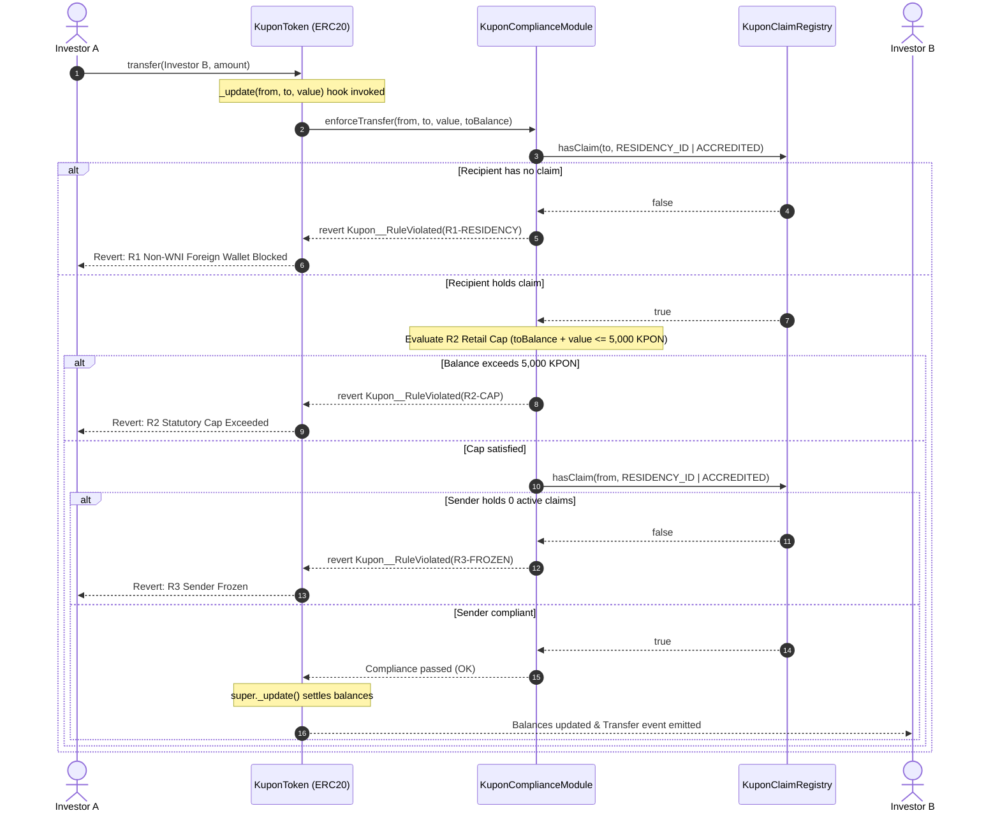

# Kupon 🏛️

> **Tokenized Indonesian sovereign retail bonds where every transfer obeys on-chain compliance.**  
> A compliance-gated RWA tokenization protocol — built from scratch at ETHGlobal ETHOnline, Sep 4–13, 2026.

[](https://kupon-rwa.vercel.app/)
[](https://sepolia.basescan.org/address/0x65c5a5ed0b13d17051a20e3570c54e1bcf3de409)
[](./packages/hardhat/test/)
[](./SPEC.md)
[](./docs/threat-model.md)

---

## Executive Summary

Kupon solves the critical compliance primitive required to issue sovereign and institutional debt on public EVM blockchains: **transfer-level compliance enforcement that cannot be bypassed by any user, interface, or smart contract.**

Modeled after the Indonesian Ministry of Finance's retail government bond program (**SBN Ritel** / *ORI026-T3* benchmark), Kupon proves how national residency gates (KSEI Single Investor Identification), statutory retail holding caps (Rp5 Billion per citizen), and sovereign asset freezing can be strictly enforced directly within the token's bytecode.

### Live Deployments (Base Sepolia — Chain ID: 84532)

| Contract | Verified Address | Explorer Link | Standard / Roles |
|---|---|---|---|
| **`KuponToken`** | `0x65c5a5ed0b13d17051a20e3570c54e1bcf3de409` | [Basescan](https://sepolia.basescan.org/address/0x65c5a5ed0b13d17051a20e3570c54e1bcf3de409#code) | ERC-20 + Compliance Hook (`_update`), Series Cap |
| **`KuponComplianceModule`** | `0xd473730c87c0145b2a431f39b91c06d25cc8e41a` | [Basescan](https://sepolia.basescan.org/address/0xd473730c87c0145b2a431f39b91c06d25cc8e41a#code) | Stateless rule engine: `R1-RESIDENCY`, `R2-CAP`, `R3-FROZEN` |
| **`KuponClaimRegistry`** | `0xf550e31300cc8f3e675c83d58648ddf73775fe50` | [Basescan](https://sepolia.basescan.org/address/0xf550e31300cc8f3e675c83d58648ddf73775fe50#code) | Sovereign Identity Claims (`RESIDENCY_ID`, `ACCREDITED`) |
| **Deployer Authority** | `0x2b97bea17da0ff83fd95a73dc60881d5b27a2b9b` | [Basescan](https://sepolia.basescan.org/address/0x2b97bea17da0ff83fd95a73dc60881d5b27a2b9b) | `REGISTRAR_ROLE`, `ISSUER_ROLE`, `COMPLIANCE_ADMIN` |

---

## Why Indonesia, Why Now

Indonesia represents Southeast Asia's most dynamic digital-asset proving ground, with over **21 million registered crypto investors** compared to fewer than **1.1 million retail government bond holders**—a 20x adoption disparity. 

This quarter (**Q3 2026**), Indonesia's financial regulator (**OJK — Otoritas Jasa Keuangan**) is scheduled to publish its landmark regulatory rulebook for **real-world asset (RWA) tokenization**, formalizing the transition of crypto oversight into the national securities perimeter:

1. **UU P2SK** (*Undang-Undang Pengembangan dan Penguatan Sektor Keuangan No. 4/2023*) — Mandates the historic transfer of digital financial asset supervision from commodity regulator Bappebti to OJK.
2. **POJK 27/2024 & POJK 23/2025** — Establishes the national regulatory sandbox and digital financial asset trading architecture, effective January 10, 2025.
3. **Transition Milestone** — OJK and Bappebti concluded their institutional handover MoU in 2026.
4. **Targeted Rulebook Publication** — Targeted for delivery in Q3 2026 (*Kontan, June 8, 2026, address by OJK Head of Financial Sector Technology Innovation*).
5. **Bank Indonesia Project Garuda** — National Digital Rupiah (wCBDC) architectural design targeting atomic on-chain Delivery-versus-Payment (DvP) for government securities.

Kupon implements the exact missing infrastructure required by these frameworks: **a compliant sovereign bond ledger where compliance is not an afterthought in a front-end form, but an immutable law of the smart contract.**

---

## System Architecture

Kupon implements a simplified, gas-optimized adaptation of the **ERC-3643 (T-REX)** permissioned token standard across three distinct institutional tiers:

```
┌──────────────────────────────────────────────────────────────────────────────────────────────────┐
│                                   KUPON INSTITUTIONAL DESK TIERS                                 │
├───────────────────────────────┬───────────────────────────────┬──────────────────────────────────┤
│ 1. INVESTOR DESK (/app)       │ 2. REGISTRAR DESK (/registrar)│ 3. REGULATOR TERMINAL (/regulator)│
│    • Primary Market (ORI026)  │    • KSEI SID Identity Auth   │    • 4-Act Compliance Narrative  │
│    • Secondary Market (P2P)   │    • Proof of Personhood      │    • Live Telemetry Event Stream │
│    • Pre-Flight Rule Check    │    • Claim Grant / Revoke     │    • eth_call State Simulation   │
├───────────────────────────────┼───────────────────────────────┼──────────────────────────────────┤
│ Partner: PRIVY                │ Partner: WORLD ID             │ Partner: THE GRAPH               │
│ Embedded wallet, 1-click      │ Zero-knowledge proof of       │ Base Sepolia Subgraph indexing   │
│ social & email onboarding     │ personhood (1-human-1-WNI)    │ ClaimEvents & TransferAudits     │
└───────────────┬───────────────┴───────────────┬───────────────┴─────────────────┬────────────────┘
                │                               │                                 │
                ▼                               ▼                                 ▼
┌──────────────────────────────────────────────────────────────────────────────────────────────────┐
│                                ON-CHAIN PROTOCOL & COMPLIANCE CORE                               │
│                                                                                                  │
│  ┌─────────────────────────┐          transfer() / transferFrom()         ┌───────────────────┐  │
│  │   Investor EOA Wallet   │ ───────────────────────────────────────────▶ │   KuponToken.sol  │  │
│  └─────────────────────────┘                                              │      (ERC-20)     │  │
│                                                                           └─────────┬─────────┘  │
│                                                                                     │            │
│                                                                _update() hook calls │            │
│                                                                                     ▼            │
│  ┌─────────────────────────┐              read live claims                ┌───────────────────┐  │
│  │   KuponClaimRegistry    │ ◀─────────────────────────────────────────── │  KuponCompliance  │  │
│  │     (Identity State)    │                                              │      Module       │  │
│  └─────────────────────────┘                                              └───────────────────┘  │
│                ▲                                                                                 │
│                │ grantClaim() / revokeClaim()                                                    │
│  ┌─────────────┴───────────┐                                                                     │
│  │    Registrar Authority  │ (Deployer EOA with REGISTRAR_ROLE)                                  │
│  └─────────────────────────┘                                                                     │
└──────────────────────────────────────────────────────────────────────────────────────────────────┘
```

### Component & Transfer Sequence Flow



---

## Compliance Rules Specification

Every balance update—whether executed via standard `transfer()`, `transferFrom()`, minting issuance, or a third-party contract—evaluates three statutory compliance invariants:

| Rule Identifier | Legal Grounding | Policy Invariant | On-Chain Revert |
|---|---|---|---|
| **`R1-RESIDENCY`** | **UU P2SK Art. 34 & KSEI SID** | Retail bond tranches are legally restricted to verified Indonesian citizens. Both sender and recipient must hold `RESIDENCY_ID` or institutional `ACCREDITED`. | `Kupon__RuleViolated(0x...R1)` |
| **`R2-CAP`** | **DJPPR Ministry of Finance Quota** | Retail investors cannot accumulate more than **5,000 KPON** (Rp5 Billion par value). Accredited institutional investors are exempt from the retail cap. | `Kupon__RuleViolated(0x...R2)` |
| **`R3-FROZEN`** | **PPATK Sanctions & Circuit Breaker** | If an investor's credentials are revoked by the registrar, their account instantly enters a zero-claim state. All outgoing transfers are blocked immediately. | `Kupon__RuleViolated(0x...R3)` |

* **Series Issuance Ceiling:** Total supply is constrained by an immutable on-chain constant `SERIES_CAP = 100,000 KPON` (Rp100 Billion). Issuance requires `ISSUER_ROLE` and passes through identical compliance gates.
* **Unit Par Value:** $1\text{ KPON} = 1\text{ Bond} = \text{Rp1,000,000 nominal}$ (18 decimals standard).

---

## Application Desks & Demo Experience

Kupon provides four cohesive interfaces built with the custom **Sovereign Certificate** design system:

1. **Investor Portal (`/app`)**:
   * **Primary Market Desk:** Subscribe to open sovereign bond series (*ORI026-T3*, 3-Year, 6.40% p.a. fixed coupon). Interactive yield calculator displaying monthly passive cash flow and cumulative profit at maturity.
   * **Secondary Market Desk:** 24/7 peer-to-peer bond trading desk featuring **Live Pre-Flight Rule Evaluation** that previews on-chain verdicts (R1/R2/R3) before signing transactions.
   * **Portfolio Wealth Strip:** Real-time visibility into capital invested, projected monthly income, and statutory quota headroom ($X / 5,000\text{ KPON}$).
   * **Transaction Feed:** Real-time on-chain indexing of primary mints, P2P receipts, and sent transfers.

2. **Registrar Desk (`/registrar`)**:
   * **KSEI SID Certification:** National identity verification portal allowing credentialed authorities to grant or revoke `RESIDENCY_ID` and `ACCREDITED` claims.
   * **Proof of Personhood:** Integrated World ID verification ensuring 1-human-1-citizen allocation before sovereign claim issuance.
   * **Macro Quota Tracking:** Live telemetric monitoring of total bonds issued vs. remaining statutory series capacity.

3. **Regulator Supervisory Terminal (`/regulator`)**:
   * **Interactive 4-Act Compliance Narrative:** Live guided controller demonstrating statutory enforcement:
     * *Act I:* Uncertified foreign transfer blocked under Rule R1.
     * *Act II:* Verified citizen transfer settles instantly with on-chain DvP.
     * *Act III:* Statutory retail cap enforced on excessive transfer under Rule R2.
     * *Act IV:* Emergency freeze executed via credential revocation under Rule R3.
   * **Real-Time Audit Stream:** High-speed event telemetry powered by The Graph Subgraph indexing `ClaimGranted`, `ClaimRevoked`, and `Transfer` logs.
   * **Zero-Cost Simulation Engine:** Direct `eth_call` execution of `enforceTransfer` allowing supervisors to simulate prospective transfers without gas fees.

4. **Regulatory Briefing (`/framework`)**:
   * Complete legal grounding detailing UU P2SK, POJK 27/2024, POJK 3/2024, KSEI SID structure, and Bank Indonesia Project Garuda wCBDC atomic settlement.

---

## Security & Threat Model Summary

For full technical specifications, read the dedicated [**Kupon Threat Model & Security Invariants**](./docs/threat-model.md).

* **Bytecode-Level Enforcement:** Compliance checks are anchored in OpenZeppelin ERC-20 `_update()`. No balance change can occur without satisfying compliance, eliminating interface and router bypass vulnerabilities.
* **Zero PII Exposure:** No private citizen data (KTP numbers, names, addresses) is ever stored on-chain. Identities are stored solely as 32-byte cryptographic hashes (`keccak256("RESIDENCY_ID")`), satisfying Indonesian PDP Law No. 27/2022.
* **Overflow Protection:** Defensive arithmetic patterns (`value > CAP || toBalance > CAP - value`) prevent overflow edge cases in compliance checks.
* **Demo Centralization Disclosure:** For the ETHOnline hackathon demo, the deployer EOA holds the registrar, issuer, and compliance admin roles. In a production deployment, these roles are partitioned across KSEI, OJK, and Kemenkeu institutional multi-sigs.
* **Omission of Forced Transfers:** Standard ERC-3643 `forcedTransfer()` was deliberately omitted to prevent unilateral seizure exploits without production timelock governance.

---

## Testing & Invariants Verification

The core smart contract suite achieves **100% path coverage on compliance rules**, verified via unit tests and pseudo-random fuzz invariants:

```bash
yarn test
```

### Test Suite Highlights (42 Passing Tests)
* **`KuponClaimRegistry`:** Role-based access control, grant/revoke state transitions, idempotent claim handling, unauthorized call reverts.
* **`KuponComplianceModule`:** Strict R1 residency gate checks, R2 cap boundary testing (`exact = pass`, `+1 = revert`), R3 zero-claim freeze enforcement, non-admin role protection.
* **`KuponToken`:** ERC-20 accounting, `_update` compliance invocation, `issue()` within series cap, `transferFrom` compliance equivalence.

### Fuzz Testing Invariants (`seed = 20260906`)
1. **Invariant 1 (`inv-1-no-claim`):** Across 200 random address generations, no transfer ever succeeds to a wallet lacking verified identity claims.
2. **Invariant 2 (`inv-2-cap-never-breached`):** Across 200 randomized transfer amount combinations, a retail wallet's balance never exceeds 5,000 KPON.
3. **Invariant 3 (`inv-3-no-bypass`):** Indirect transfers using `approve()` and `transferFrom()` cannot bypass compliance rules under any condition.

---

## Partner Integrations (ETHOnline 2026)

Kupon natively integrates three premier ecosystem partners:

1. **Privy (`@privy-io/react-auth`)**:
   * **Use Case:** Non-crypto citizen onboarding on `/app`.
   * **Implementation:** 1-click email and Google social login generating an embedded smart wallet, eliminating the need for browser extensions or initial gas acquisition.

2. **World ID (`@worldcoin/idkit`)**:
   * **Use Case:** Sybil-resistant sovereign identity verification on `/registrar`.
   * **Implementation:** Zero-knowledge Proof of Personhood validation before the registrar grants a `RESIDENCY_ID` claim, guaranteeing 1-human-1-citizen bond allocation. Backed by `/api/world-id/rp-signature` backend signing.

3. **The Graph**:
   * **Use Case:** Immutable regulatory audit trail on `/regulator`.
   * **Implementation:** Dedicated Subgraph manifest (`packages/subgraph`) indexing `ClaimEvent`, `TransferEvent`, and aggregated `InvestorComplianceState` on Base Sepolia.

---

## Complete Build Log

Developed solo from scratch under the ETHGlobal Classic "From Scratch" track:

* **Sep 4, 2026 (Kickoff & Gate 0):** Project bootstrapped on Scaffold-ETH 2; multi-account git SSH alias configured (`tremov`); initial Vercel pipeline deployed; prize rubric selection finalized.
* **Sep 5, 2026 (Spec & PRD Approval):** Authored canonical [SPEC.md](./SPEC.md) and [SPEC-ID.md](./SPEC-ID.md); conducted adversarial review; broke down 12-task implementation plan.
* **Sep 6, 2026 (Gate 1 Closed Early & Brand Overhaul):** Completed smart contract suite (`KuponClaimRegistry`, `KuponComplianceModule`, `KuponToken`); passed 42 unit tests and 3 fuzz invariants; verified contracts on Base Sepolia; completed Brand Overhaul to Sovereign Certificate aesthetic; delivered Registrar Portal and Regulator Terminal.
* **Sep 7, 2026 (Phase 2 Architectural Alignment & Desks):** Unified $KPON as the single benchmark series (*ORI026-T3*); built Primary Market Desk with DJPPR bond catalog; added Portfolio Wealth Strip and real-time Transaction Feed; overhauled `/framework` into institutional broadsheet; integrated Privy, World ID, and The Graph Subgraph.
* **Sep 8, 2026 (Infra Hardening & Task 11 Finalization):** Resolved RPC rate limits via edge transports; finalized World ID v4 signature flow; published comprehensive Threat Model (`docs/threat-model.md`) and System Architecture diagrams.

---

## Local Development & Setup

### Prerequisites
* Node.js ≥ 20.18
* Yarn 4 (`corepack enable`)

### Quick Start

```bash
# 1. Clone repository
git clone https://github.com/tremovdev/kupon.git
cd kupon

# 2. Install dependencies
yarn install

# 3. Terminal 1: Run local blockchain
yarn chain

# 4. Terminal 2: Deploy smart contracts
yarn deploy

# 5. Terminal 3: Launch Next.js web application
yarn start
# Open http://localhost:3000
```

### Environment Variables
Explorer API keys and RPC secrets must live in a gitignored local `.env` file—never committed:

```bash
# packages/hardhat/.env
ALCHEMY_API_KEY="your-alchemy-key"
ETHERSCAN_API_KEY="your-basescan-key"
__RUNTIME_DEPLOYER_PRIVATE_KEY="0x..."

# packages/nextjs/.env.local
NEXT_PUBLIC_ALCHEMY_API_KEY="your-alchemy-key"
NEXT_PUBLIC_PRIVY_APP_ID="your-privy-app-id"
```

---

## Disclosures & Attributions

* **Boilerplate:** Bootstrapped via [Scaffold-ETH 2](https://github.com/scaffold-eth/scaffold-eth-2) (Next.js, Hardhat, wagmi, viem, RainbowKit).
* **Smart Contract Libraries:** [OpenZeppelin Contracts v5](https://github.com/OpenZeppelin/openzeppelin-contracts) (`ERC20`, `AccessControl`).
* **Standard Pattern Reference:** [ERC-3643 (T-REX)](https://eips.ethereum.org/EIPS/eip-3643) permissioned token standard. Kupon implements a streamlined on-chain claim registry mapping to reflect national KSEI SID architecture.
* **AI Assistance:** Spec-driven development using Claude Code. All architectural specs, planning task graphs, and prompt records are committed directly to this repository under ETHGlobal AI attribution rules.

---

## Disclaimer

**"SBN Ritel 2027" (Kupon) is a fictional financial instrument** created exclusively for technological demonstration at ETHGlobal ETHOnline 2026. This project has no official affiliation with the Ministry of Finance of the Republic of Indonesia (Kemenkeu), the Directorate General of Financing and Risk Management (DJPPR), the Financial Services Authority (OJK), Bank Indonesia (BI), or PT Kustodian Sentral Efek Indonesia (KSEI). Nothing contained herein constitutes financial, legal, or investment advice.
